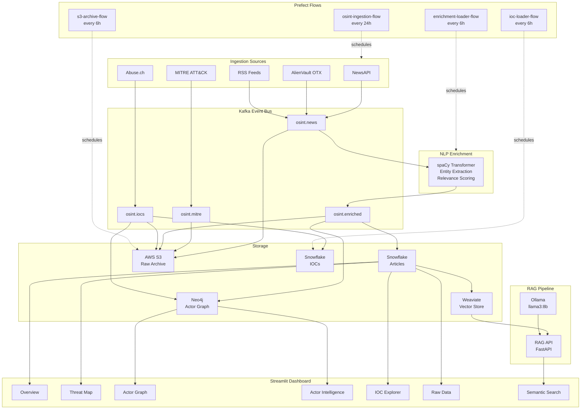
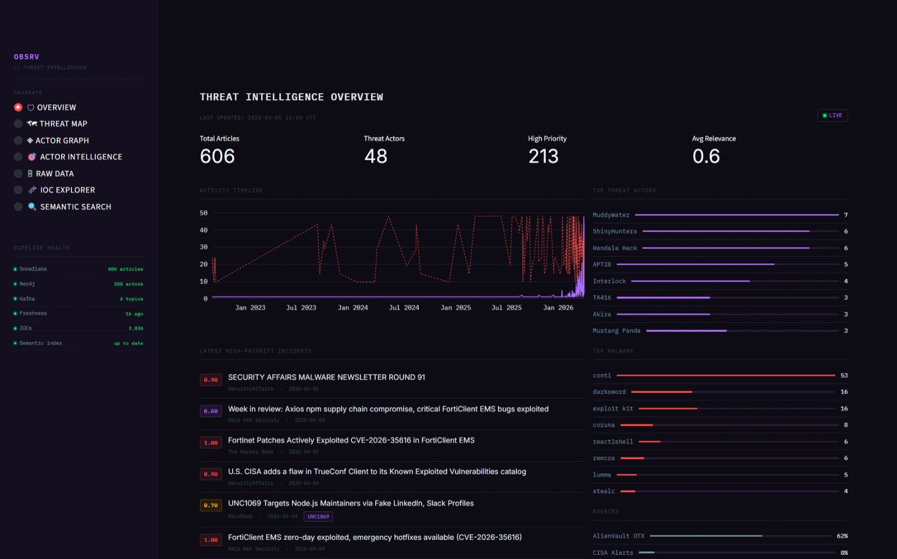
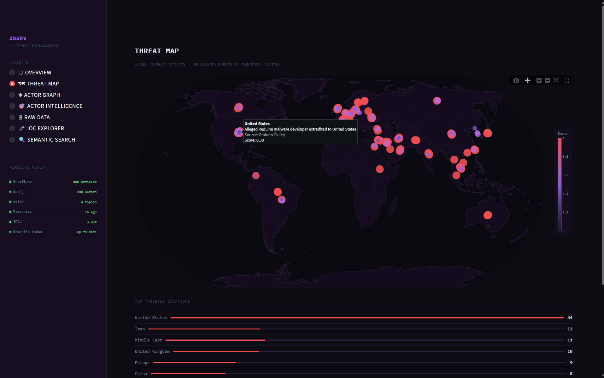
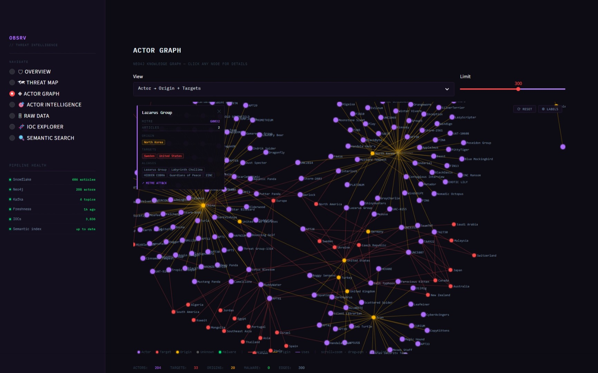
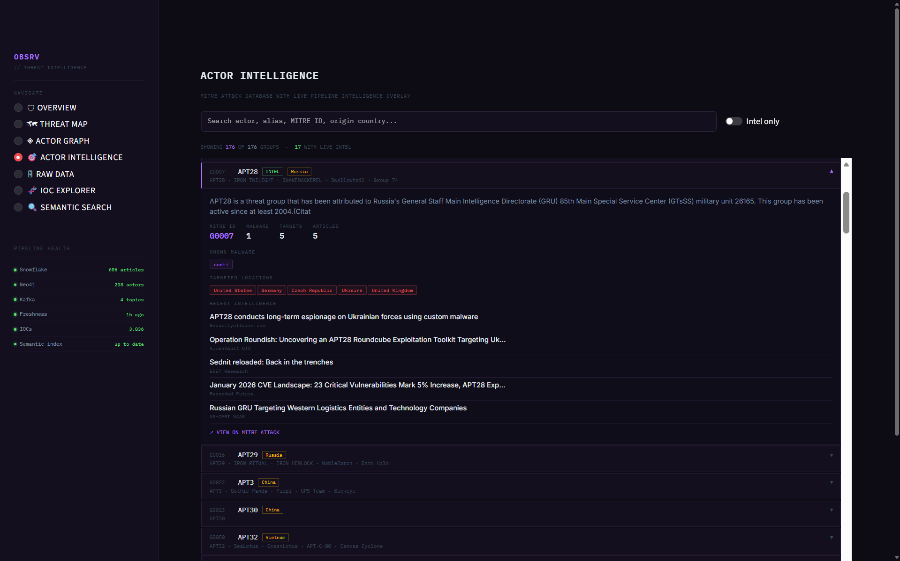
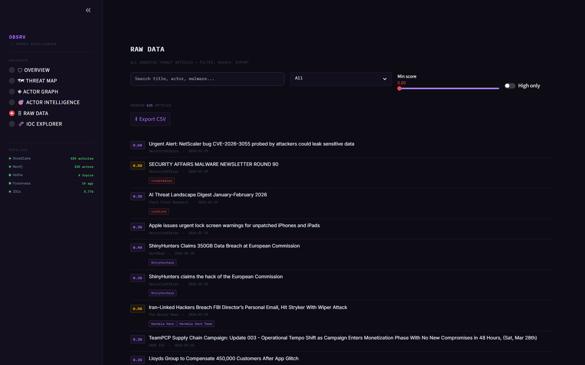
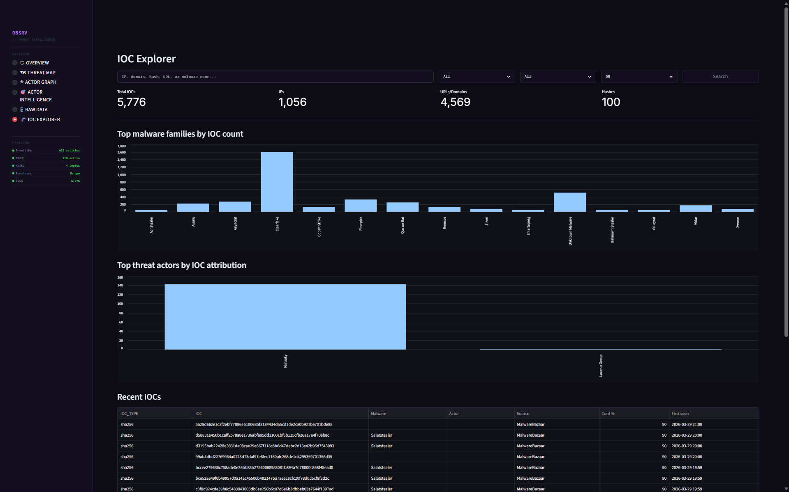
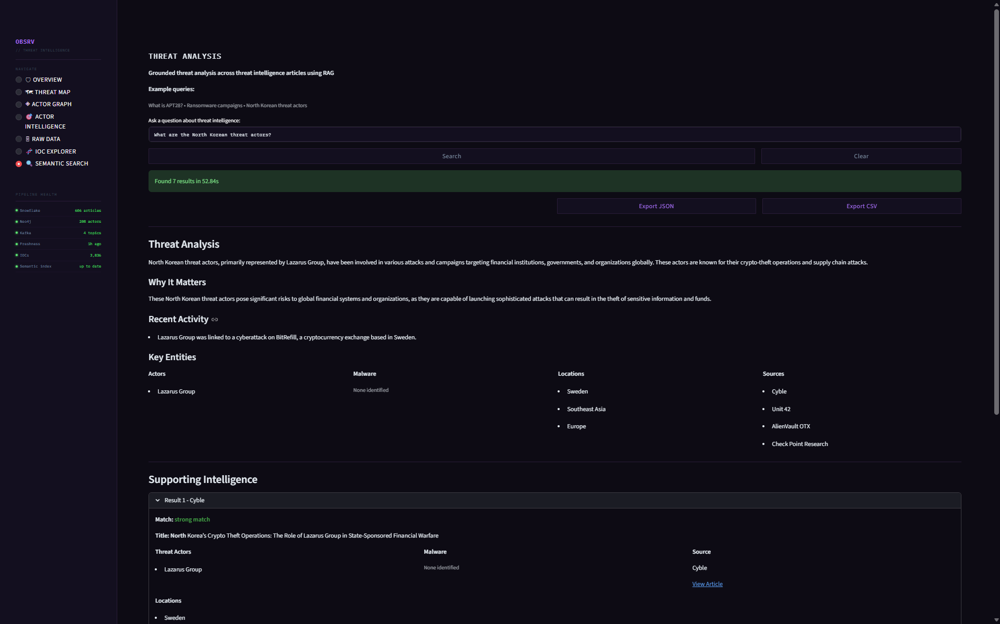
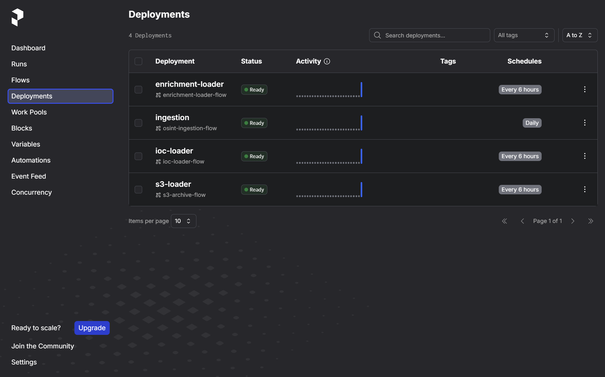
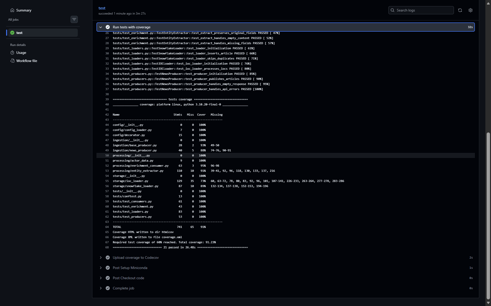

# OSINT Threat Intelligence Pipeline

[](https://github.com/cristi4nhdz/osint-threat-intel-pipeline/actions/workflows/test.yml)
[](https://github.com/cristi4nhdz/osint-threat-intel-pipeline/actions/workflows/code-quality.yml)
[](https://codecov.io/gh/cristi4nhdz/osint-threat-intel-pipeline)
[](https://www.python.org/downloads/)

A real-time cybersecurity intelligence pipeline that ingests threat data from 5 sources across 4 Kafka topics, enriches articles using spaCy NLP with 200+ mapped threat actors and 100+ malware families, stores enriched data in Snowflake and Neo4j, archives raw events to S3, and displays insights through a 7-page Streamlit dashboard, with 4 Prefect flows automating the entire pipeline on a scheduled basis and an AI-powered threat analyst backed by Ollama and Weaviate.

---

## Table of Contents

- [Overview](#overview)
- [Architecture](#architecture)
- [Screenshots](#screenshots)
- [Tech Stack](#tech-stack)
- [Features](#features)
- [Getting Started](#getting-started)
  - [Prerequisites](#prerequisites)
  - [Environment Setup](#environment-setup)
  - [Running the Pipeline](#running-the-pipeline)
- [Project Structure](#project-structure)

---

## Overview

Pulls cybersecurity and threat intel from NewsAPI, AlienVault OTX, RSS feeds, Abuse.ch, and MITRE ATT&CK, pushes raw events into Kafka, and runs NLP enrichment via spaCy transformer models to extract entities and signals. Enriched output is loaded into Snowflake for storage and Neo4j for relationship graph building across 200+ threat actors. Raw Kafka messages are archived to AWS S3 in JSON batches for disaster recovery. A 7-page Streamlit dashboard provides live visualization of threats, actors, IOCs, geo activity, and AI-powered semantic search via a RAG pipeline backed by Weaviate and Ollama. 4 Prefect flows orchestrate the entire pipeline automatically inside Docker.

---

## Architecture



---

## Screenshots

### Overview



### Threat Map



### Actor Graph



### Actor Intelligence



### Raw Data



### IOC Explorer



### Semantic Search



### Prefect Scheduled Flows



### GitHub Actions CI



---

## Tech Stack

| Layer | Technology |
| --- | --- |
| Language | Python 3.x |
| NLP | spaCy (`en_core_web_trf`) |
| Messaging | Apache Kafka |
| Storage | Snowflake, AWS S3 |
| Vector Store | Weaviate |
| Graph | Neo4j |
| LLM | Ollama (`llama3:8b`) |
| Dashboard | Streamlit, Plotly, D3.js |
| Orchestration | Prefect, Docker Compose |
| Testing | pytest, pytest-cov, GitHub Actions |
| Environment | Conda |
| Linting | flake8, pylint, black, mypy, yamllint, GitHub Actions |

---

## Features

- **5-Source Ingestion** — NewsAPI, AlienVault OTX, RSS feeds, Abuse.ch, and MITRE ATT&CK all publishing to Kafka
- **NLP Enrichment** — Entity extraction and threat signal classification using spaCy's `en_core_web_trf` transformer model, with keyword-based matching across 200+ threat actors and 100+ malware families
- **Relevance Scoring** — Articles scored 0.0–1.0 and filtered before publishing to the enriched topic
- **Snowflake Storage** — Enriched articles loaded into Snowflake with automatic table setup and URL deduplication
- **IOC Storage** — Indicators of compromise loaded from Kafka into Snowflake every 6 hours
- **S3 Archival** — Raw Kafka messages from all 4 topics archived to AWS S3 in JSON batches every 6 hours for disaster recovery and downstream processing
- **Neo4j Graph** — Actor relationship graph linking 200+ threat actors to malware, locations, and origin countries, refreshed every 6 hours via Prefect
- **RAG Semantic Search** — Weaviate vector store with sentence-transformer embeddings and Ollama-powered grounded threat analysis via a FastAPI RAG API
- **7-Page Streamlit Dashboard** — Overview metrics, geo threat map, interactive D3 actor graph, MITRE ATT&CK actor intelligence, IOC explorer, raw data explorer, and AI-powered semantic threat analyst, all served via Docker
- **IOC Explorer** — Search and filter IOCs by type, actor, and malware family with article cross-referencing and source breakdown
- **Live Pipeline Status** — Sidebar indicators for Snowflake, Neo4j, Kafka, IOCs, data freshness, and RAG API
- **Prefect Orchestration** — 4 scheduled flows running in Docker: ingestion every 24 hours, enrichment and storage loading every 6 hours, IOC loading every 6 hours, S3 archival every 6 hours
- **Kafka-Backed Event Bus** — Uses 4 Kafka topics with decoupled producers and consumers to improve reliability and enable message replay
- **Test Suite** — 21 pytest tests across enrichment, producers, consumers, and loaders with 86% code coverage, running automatically on every push via GitHub Actions
- **Config Validation** — startup validator checks all required fields, detects unfilled placeholder values, and validates numeric ranges before the pipeline runs
- **Config-Driven** — YAML-based configuration for sources, topics, retrieval settings, and pipeline behavior
- **Containerized** — Full Docker Compose setup with persistent volumes for Kafka, Neo4j, Weaviate, Ollama, Prefect server, flow runner, and dashboard

---

## Getting Started

### Prerequisites

- [Docker](https://www.docker.com/) & Docker Compose
- [Miniconda](https://docs.conda.io/en/latest/miniconda.html) or Anaconda (Optional)
- [NewsAPI](https://newsapi.org/) API key
- [AlienVault OTX](https://otx.alienvault.com/) API key
- [Abuse.ch](https://hunting.abuse.ch/api/) API key
- AWS S3 bucket and credentials

### Environment Setup

**1. Clone the repository:**

```bash
git clone https://github.com/cristi4nhdz/osint-threat-intel-pipeline.git
cd osint-threat-intel-pipeline
```

**2. Configure your environment:**

```bash
cp config/settings.example.yaml config/settings.yaml
# edit settings.yaml with your keys
```

**3. (Optional) Create a local Conda environment for running tests or scripts outside Docker:**

```bash
conda env create -f environment.yaml
conda activate osint
```

### Running the Pipeline

**Start the full pipeline:**

```bash
docker compose up
```

This starts Kafka, Neo4j, Weaviate, Ollama, the Prefect server at `http://localhost:4200`, the RAG API at `http://localhost:8000`, the Streamlit dashboard at `http://localhost:8501`, and automatically deploys and runs all 4 scheduled flows:

- `osint-ingestion-flow` — runs all 5 ingestion producers every 24 hours
- `enrichment-loader-flow` — runs NLP enrichment, Snowflake loader, and Neo4j graph builder every 6 hours
- `ioc-loader-flow` — loads new IOCs into Snowflake every 6 hours
- `s3-archive-flow` — archives raw Kafka messages to S3 every 6 hours

**Run tests:**

```bash
pytest
```

**Shut down:**

```bash
docker compose down
```

---

### Test Coverage

| Module | Statements | Coverage |
| --- | --- | --- |
| `processing/actor_data.py` | 9 | 100% |
| `processing/enrichment_consumer.py` | 63 | 95% |
| `processing/entity_extractor.py` | 110 | 91% |
| `ingestion/base_producer.py` | 28 | 93% |
| `ingestion/news_producer.py` | 40 | 88% |
| `storage/snowflake_loader.py` | 87 | 89% |
| `storage/ioc_loader.py` | 129 | 73% |
| **Total** | **466** | **86%** |

## Project Structure

```text
osint-threat-intel-pipeline/
|-- .github/workflows/    # GitHub Actions CI and code quality workflows
|-- api/                  # FastAPI RAG API
|-- config/               # YAML configuration files and validator
|-- dashboard/            # Streamlit dashboard and page sections
|   |-- _sections/        # Overview, threat map, actor graph, actor intel, IOC explorer, raw data, semantic search
|-- docs/                 # Screenshots
|-- flows/                # Prefect flow definitions and deployment script
|-- ingestion/            # News, OTX, RSS, Abuse.ch, and MITRE ATT&CK producers
|-- processing/           # NLP enrichment, entity extraction, Kafka consumer
|-- services/             # LLM client and shared service utilities
|-- storage/              # Snowflake, IOC, Neo4j, S3, and vector store loaders
|-- tests/                # pytest test suite for ingestion, processing, and storage
|-- docker-compose.yml    # Container orchestration
|-- Dockerfile            # Container image definition
|-- environment.yaml      # Conda environment spec
|-- README.md
```
